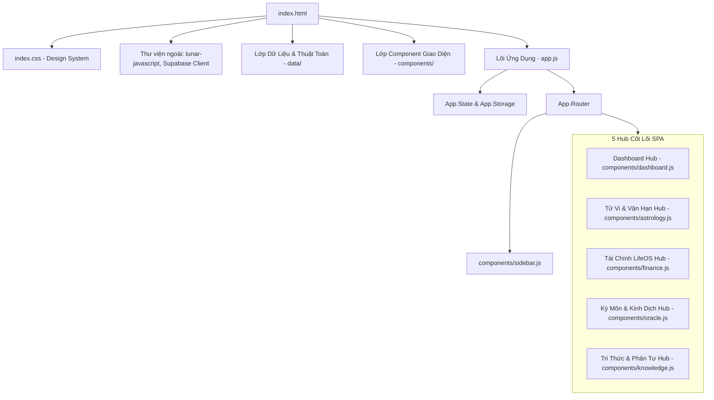

# 📘 HƯỚNG DẪN VẬN HÀNH & CẤU TRÚC FILE HỆ THỐNG
## Ứng Dụng: NỘI TÂM — Tri Thức Cá Nhân & Tử Vi Ứng Dụng (LifeOS)

---

## 1. TỔNG QUAN KIẾN TRÚC & LUỒNG VẬN HÀNH (ARCHITECTURAL OVERVIEW)

Ứng dụng **NỘI TÂM** được thiết kế theo kiến trúc **Single Page Application (SPA) Pure JavaScript (Vanilla JS)** kết hợp **Local-first Storage** (luôn hoạt động offline qua `localStorage` và tự động đồng bộ lên **Supabase Cloud**).

### Luồng Khởi Chạy & Điều Hành Toàn Cục:

---

## 2. PHÂN LOẠI & CHI TIẾT CÁCH VẬN HÀNH CÁC FILE

### ⚙️ 2.1. Lớp Lõi Điều Hành & Quản Lý Trạng Thái (App Core & System Controllers)

* [app.js](file:///i:/Drive%20c%E1%BB%A7a%20t%C3%B4i/apps/App_Canhan/app.js)
  * **Vai trò**: Bộ não trung tâm của toàn bộ ứng dụng.
  * **Cơ chế vận hành**:
    1. **Khởi tạo (`App.init()`)**: Nạp hồ sơ người dùng (`App.State.profile`), kích hoạt theme Ngũ Hành, khởi tạo bộ nhớ offline (`App.Storage`) và kết nối Supabase.
    2. **Bộ điều hướng (`App.Router`)**: Lắng nghe sự kiện đổi tab/route, gọi hàm render tương ứng của từng Hub và quản lý Alias điều hướng.
    3. **Quản lý UI dùng chung**: Cung cấp các hàm tiện ích toàn cục như `App.showToast()`, `App.showModal()`, `App.showDetailPanel()`.

* [index.html](file:///i:/Drive%20c%E1%BB%A7a%20t%C3%B4i/apps/App_Canhan/index.html)
  * **Vai trò**: File HTML duy nhất chứa khung xương giao diện (DOM Shell).
  * **Cơ chế vận hành**: Nạp các font chữ Google (Cinzel, Inter, Montserrat), các stylesheet, thư viện tính Âm Dương Lịch `lunar-javascript`, thư viện Supabase JS, và nạp tất cả các file JavaScript theo thứ tự phụ thuộc (Data -> Components -> App).

* [index.css](file:///i:/Drive%20c%E1%BB%A7a%20t%C3%B4i/apps/App_Canhan/index.css)
  * **Vai trò**: Design System Đông Phương Cổ Điển pha lẫn Hiện Đại (Glassmorphism, Dark Mode).
  * **Cơ chế vận hành**: Định nghĩa CSS Variables cho màu sắc Ngũ Hành (Kim, Mộc, Thủy, Hỏa, Thổ), font chữ Hoàng Kim, bố cục chia lưới (Grid System), hiệu ứng chuyển cảnh mượt mà và responsive trên thiết bị di động / desktop.

---

### 🧠 2.2. Lớp Thuật Toán Toán Học & Tri Thức Dữ Liệu (Data Engine Layer)

* [data/astrology_logic.js](file:///i:/Drive%20c%E1%BB%A7a%20t%C3%B4i/apps/App_Canhan/data/astrology_logic.js)
  * **Vai trò**: Engine tính toán thuật số trung tâm.
  * **Cơ chế vận hành**:
    * **Lập Lá Số Tử Vi**: An 12 Cung, Cục, Mệnh, 14 Chính Tinh, Vòng Thái Tuế, Lộc Tồn, Tràng Sinh và các Phụ Tinh.
    * **Thuật toán Trạch Nhật 4 Tầng**: Chấm điểm ngày Cát/Hung theo Ngũ hành sinh khắc, Sao Tử Vi chiếu, Tiết khí và Can Chi.
    * **Smart Target Scanner**: Thuật toán quét tự động tìm Top 3 Ngày Vàng cho Thi cử, Phỏng vấn, Ký hợp đồng, Trình sếp.
    * **Sóng Sinh Học 3D (Biorhythm)**: Tính đường sóng Thể chất, Cảm xúc, Trí tuệ.
    * **Trạch Nhật 12 Canh Giờ 24H**: Phân tích cát hung từng khung giờ trong ngày.
    * **LES Score (Life Energy Score)** & **Mai Hoa Dịch Số**.

* [data/tuvi.js](file:///i:/Drive%20c%E1%BB%A7a%20t%C3%B4i/apps/App_Canhan/data/tuvi.js)
  * **Vai trò**: Cơ sở dữ liệu Tri Thức Tử Vi.
  * **Cơ chế vận hành**: Chứa từ điển các sao (14 Chính Tinh, Lục Sát Tinh, Cát Tinh), các khẩu quyết luận giải ý nghĩa từng sao tại 12 Cung, các phép biến thiên theo Lưu Niên.

* [data/supabase_client.js](file:///i:/Drive%20c%E1%BB%A7a%20t%C3%B4i/apps/App_Canhan/data/supabase_client.js)
  * **Vai trò**: Bộ tích hợp Cloud Supabase Database & Realtime.
  * **Cơ chế vận hành**: Khai báo kết nối Supabase REST API, cung cấp hàm đồng bộ dữ liệu giữa LocalStorage và Cloud Storage.

* [data/sample.js](file:///i:/Drive%20c%E1%BB%A7a%20t%C3%B4i/apps/App_Canhan/data/sample.js)
  * **Vai trò**: Dữ liệu khởi tạo mặc định (Seed Data).
  * **Cơ chế vận hành**: Cung cấp dữ liệu mẫu ban đầu cho Bài học, Quy luật cuộc sống, Lời nhắc và Nhật ký nếu người dùng chưa có dữ liệu cá nhân.

---

### 🏛️ 2.3. Lớp Các Hub Giao Diện & Component Chức Năng (UI Hubs & Modules)

#### 1️⃣ Master Calendar & Dashboard Hub
* [components/sidebar.js](file:///i:/Drive%20c%E1%BB%A7a%20t%C3%B4i/apps/App_Canhan/components/sidebar.js): Thanh menu điều hướng chính, kích hoạt các tuyến route trong `App.Router`.
* [components/dashboard.js](file:///i:/Drive%20c%E1%BB%A7a%20t%C3%B4i/apps/App_Canhan/components/dashboard.js): Lịch Ngày Tốt Master, tích hợp Engine vẽ HTML5 Canvas **6 Trụ Cột Life Balance Radar Chart**, Smart Target Scanner, Bảng Năng Lượng Ngày 13-in-1, và Modal Chi Tiết Ngày 7 Tab.

#### 2️⃣ Tử Vi & Vận Hạn Hub
* [components/astrology.js](file:///i:/Drive%20c%E1%BB%A7a%20t%C3%B4i/apps/App_Canhan/components/astrology.js): Hub chính điều phối các module liên quan đến lá số Tử vi.
* [components/overview.js](file:///i:/Drive%20c%E1%BB%A7a%20t%C3%B4i/apps/App_Canhan/components/overview.js): Giao diện Lá Số Tử Vi chi tiết 12 Cung và Tổng Quan Cuộc Đời.
* [components/timemachine.js](file:///i:/Drive%20c%E1%BB%A7a%20t%C3%B4i/apps/App_Canhan/components/timemachine.js): Mô phỏng Time-Machine 60 Năm Cuộc Đời, Slider độ tuổi 20-80, Energy Heatmap Strip và Pinning mốc sự kiện đời thực.
* [components/rpg.js](file:///i:/Drive%20c%E1%BB%A7a%20t%C3%B4i/apps/App_Canhan/components/rpg.js): Bảng chỉ số nhân vật Cải Mệnh RPG Sheet.
* [components/retroverify.js](file:///i:/Drive%20c%E1%BB%A7a%20t%C3%B4i/apps/App_Canhan/components/retroverify.js): Công cụ đối soát & kiểm chứng các mốc sự kiện quá khứ với vận hạn Tử vi.

#### 3️⃣ Cải Mệnh, Sức Khỏe & Rèn Luyện Thân Tâm
* [components/morning.js](file:///i:/Drive%20c%E1%BB%A7a%20t%C3%B4i/apps/App_Canhan/components/morning.js): Bản tin Cải Mệnh & Đơn thuốc 4 Trụ Cột Buổi Sáng (Trà, Y phục, Âm thanh, Vi hành động).
* [components/tasks.js](file:///i:/Drive%20c%E1%BB%A7a%20t%C3%B4i/apps/App_Canhan/components/tasks.js): Checklist Nhiệm Vụ Cải Mệnh & Hệ thống tích điểm Phúc Đức.
* [components/health.js](file:///i:/Drive%20c%E1%BB%A7a%20t%C3%B4i/apps/App_Canhan/components/health.js): Trợ lý Sức Khỏe Ngũ Hành & Cảnh báo tạng phủ dễ tổn thương theo Nhật hạn.
* [components/meditation.js](file:///i:/Drive%20c%E1%BB%A7a%20t%C3%B4i/apps/App_Canhan/components/meditation.js): Trình phát Nhạc Thiền Tần Số Solfeggio (Web Audio API Synthesizer) & Canvas Hướng dẫn Hít thở Animated Breathing.

#### 4️⃣ Kỳ Môn & Kinh Dịch Hub (Oracle)
* [components/oracle.js](file:///i:/Drive%20c%E1%BB%A7a%20t%C3%B4i/apps/App_Canhan/components/oracle.js): Hub điều hành quản lý 2 sub-tabs Kỳ Môn & Kinh Dịch.
* [components/compass.js](file:///i:/Drive%20c%E1%BB%A7a%20t%C3%B4i/apps/App_Canhan/components/compass.js): La Bàn Kỳ Môn Độn Giáp xoay 8 Môn real-time, xác định Tài Thần, Quý Nhân, Hỷ Thần và Xuất Hành Nạp Khí.
* [components/iching.js](file:///i:/Drive%20c%E1%BB%A7a%20t%C3%B4i/apps/App_Canhan/components/iching.js): 64 Quẻ Kinh Dịch, Lập quẻ Mai Hoa Dịch Số và Trình Gieo Quẻ Đồng Xu 3D.

#### 5️⃣ Tri Thức, Nhật Ký & Tài Chính LifeOS
* [components/knowledge.js](file:///i:/Drive%20c%E1%BB%A7a%20t%C3%B4i/apps/App_Canhan/components/knowledge.js): Hub quản trị tri thức và phản tư.
* [components/journal.js](file:///i:/Drive%20c%E1%BB%A7a%20t%C3%B4i/apps/App_Canhan/components/journal.js): Nhật ký phản tư & 1-Tap Mood Logger.
* [components/lessons.js](file:///i:/Drive%20c%E1%BB%A7a%20t%C3%B4i/apps/App_Canhan/components/lessons.js): Quản lý bài học đúc kết cuộc sống.
* [components/library.js](file:///i:/Drive%20c%E1%BB%A7a%20t%C3%B4i/apps/App_Canhan/components/library.js): Thư viện quy luật cuộc sống.
* [components/reminders.js](file:///i:/Drive%20c%E1%BB%A7a%20t%C3%B4i/apps/App_Canhan/components/reminders.js): Quản lý danh sách lời nhắc nhở.
* [components/moodtracker.js](file:///i:/Drive%20c%E1%BB%A7a%20t%C3%B4i/apps/App_Canhan/components/moodtracker.js): Theo dõi và phân tích biểu đồ tâm trạng.
* [components/rules.js](file:///i:/Drive%20c%E1%BB%A7a%20t%C3%B4i/apps/App_Canhan/components/rules.js): Quản lý các quy tắc sống cá nhân.
* [components/finance.js](file:///i:/Drive%20c%E1%BB%A7a%20t%C3%B4i/apps/App_Canhan/components/finance.js): Sub-system Quản lý Tài Chính LifeOS (dòng tiền, thu chi, danh mục đầu tư).

#### 🛠️ 6️⃣ Các Công Cụ Bổ Trợ & Điều Hướng Nhanh
* [components/heatmap.js](file:///i:/Drive%20c%E1%BB%A7a%20t%C3%B4i/apps/App_Canhan/components/heatmap.js): Biểu đồ Sóng Nhịp Sinh Học 30 Ngày & Ma Trận Giờ Hoàng Đạo 24H (Smart Hour Finder).
* [components/commandcenter.js](file:///i:/Drive%20c%E1%BB%A7a%20t%C3%B4i/apps/App_Canhan/components/commandcenter.js): Phím tắt Command Palette (`Ctrl + K`) để truy vấn nhanh chức năng.
* [components/search.js](file:///i:/Drive%20c%E1%BB%A7a%20t%C3%B4i/apps/App_Canhan/components/search.js): Bộ tìm kiếm toàn cục (Global Search) tìm bài học, nhật ký, tính năng.

---

### 🛠️ 2.4. File Công Cụ Kiểm Thử & Chuyển Đổi Dữ Liệu (Tools & Tests)

* [migrate_supabase.html](file:///i:/Drive%20c%E1%BB%A7a%20t%C3%B4i/apps/App_Canhan/migrate_supabase.html)
  * **Vai trò**: Giao diện Web chạy độc lập giúp chuyển đổi dữ liệu từ LocalStorage lên Supabase Cloud Database.

* [test_astro.js](file:///i:/Drive%20c%E1%BB%A7a%20t%C3%B4i/apps/App_Canhan/test_astro.js)
  * **Vai trò**: Script kiểm thử độc lập các hàm toán học Tử Vi, Trạch Nhật và Nhịp Sinh Học trong `astrology_logic.js`.

---

## 3. BẢNG TỔNG HỢP QUY TRÌNH PHỐI HỢP GIỮA CÁC FILE

| Thao Tác Người Dùng | File Đầu Tiên Xử Lý | Các File Phối Hợp Kế Tiếp | Kết Quả Hiển Thị |
|---|---|---|---|
| Mở ứng dụng lần đầu | [index.html](file:///i:/Drive%20c%E1%BB%A7a%20t%C3%B4i/apps/App_Canhan/index.html) | `index.css` ➔ `data/*` ➔ `components/*` ➔ `app.js` | Hiển thị Dashboard chính |
| Đổi Tab trên Menu Sidebar | [components/sidebar.js](file:///i:/Drive%20c%E1%BB%A7a%20t%C3%B4i/apps/App_Canhan/components/sidebar.js) | `app.js` (`App.Router.navigate`) ➔ Hub Component tương ứng | Chuyển view SPA mượt mà |
| Xem Ngày Tốt trên Lịch | [components/dashboard.js](file:///i:/Drive%20c%E1%BB%A7a%20t%C3%B4i/apps/App_Canhan/components/dashboard.js) | `data/astrology_logic.js` (Chấm điểm Trạch Nhật 4 tầng) | Hiển thị điểm Cát/Hung & Modal 7 Tab |
| Săn Top 3 Ngày Vàng | [components/dashboard.js](file:///i:/Drive%20c%E1%BB%A7a%20t%C3%B4i/apps/App_Canhan/components/dashboard.js) | `data/astrology_logic.js` (`Smart Target Scanner`) | Render Top 3 ngày thích hợp nhất |
| Xem Lá Số Tử Vi Chi Tiết | [components/astrology.js](file:///i:/Drive%20c%E1%BB%A7a%20t%C3%B4i/apps/App_Canhan/components/astrology.js) | `components/overview.js` ➔ `data/astrology_logic.js` ➔ `data/tuvi.js` | Vẽ Lá Số 12 Cung & Luận Giải |
| Chạy Time-Machine 60 Năm | [components/timemachine.js](file:///i:/Drive%20c%E1%BB%A7a%20t%C3%B4i/apps/App_Canhan/components/timemachine.js) | `data/astrology_logic.js` (`getLifeTimeMachineData`) | Hiển thị Slider & Energy Heatmap |
| Xoay La Bàn Kỳ Môn | [components/compass.js](file:///i:/Drive%20c%E1%BB%A7a%20t%C3%B4i/apps/App_Canhan/components/compass.js) | `data/astrology_logic.js` | Xoay 8 Môn & Định Vị Hướng Cát |
| Phát Nhạc Thiền Solfeggio | [components/meditation.js](file:///i:/Drive%20c%E1%BB%A7a%20t%C3%B4i/apps/App_Canhan/components/meditation.js) | Web Audio API Synthesizer & Canvas 2D | Phát âm thanh 528Hz/432Hz & vòng thở |
| Thêm Nhật Ký / Bài Học | `components/journal.js` / `lessons.js` | `app.js` (`App.Storage.save`) ➔ `data/supabase_client.js` | Lưu LocalStorage & Đồng bộ Cloud |
