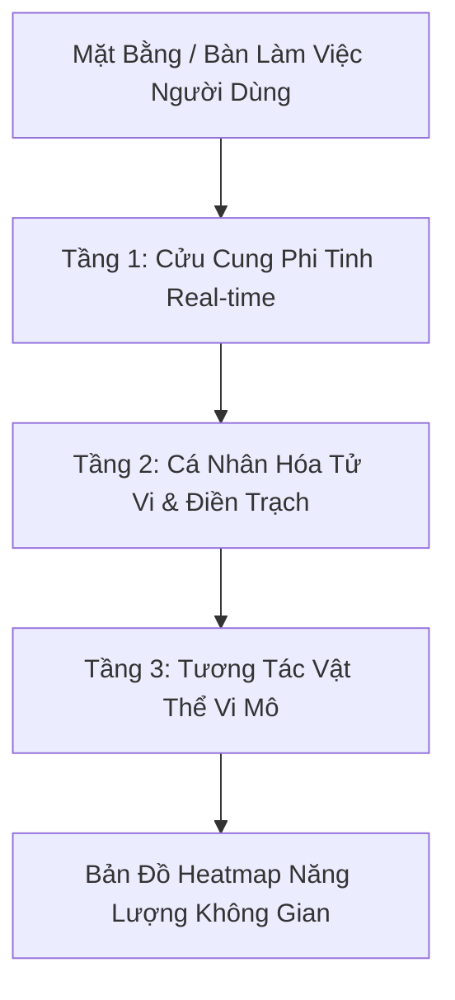

Phát triển tính năng **Bản Đồ Phong Thủy Không Gian Tương Tác (Micro-Space & Flying Stars Matrix)** là bước đi chiến lược giúp ứng dụng giải quyết triệt để rào cản của phong thủy truyền thống: *Người dùng hiện đại (dân văn phòng, người thuê căn hộ, căn hộ chung cư) không thể đập nhà, sửa cửa hay xoay hướng nhà.*

Tính năng này chuyển hướng tiếp cận sang **Phong Thủy Vi Mô (Micro-Space)**: Tối ưu hóa năng lượng ngay trên **mặt bàn làm việc, góc phòng ngủ hoặc không gian làm việc cá nhân (Workstation)** dựa trên ma trận Cửu Cung Phi Tinh biến thiên theo Thời Gian (Năm/Tháng/Ngày) và Lá số Tử Vi cá nhân.

---

## 1. Tổng Quan Kiến Trúc Thuật Toán Đa Tầng (Multi-Layer Space Engine)

Hệ thống tính toán điểm năng lượng phong thủy cho từng tọa độ không gian vi mô qua 3 tầng ma trận:



### 🔹 Tầng 1: Ma Trận Cửu Cung Phi Tinh Biến Thiên (Dynamic Flying Stars Engine)

* **Vận Lập Quẻ:** Áp dụng vận hiện tại (Vận 9 - 2024–2043, Hành Hỏa) làm nền tảng.
* **Tự Động An Cửu Tinh Theo Tiết Khí:** Tính toán chính xác vị trí 9 ngôi sao (Nhất Bạch, Nhị Hắc, Tam Bích, Tứ Lục, Ngũ Hoàng, Lục Bạch, Thất Xích, Bát Bạch, Cửu Tử) dịch chuyển theo **Năm, Tháng và Ngày**.
* **Phân Loại Cát / Hung:**
* 🟢 **Sao Cát (Cần Kích Hoạt):** Nhất Bạch (Tham Lang - Thủy/Sáng tạo), Bát Bạch (Tả Phụ - Thổ/Tài lộc), Cửu Tử (Hữu Bật - Hỏa/Mối quan hệ & Danh tiếng).
* 🔴 **Sao Hung (Cần Hóa Giải):** Ngũ Hoàng Đại Sát (Thổ/Tai họa, bệnh tật), Nhị Hắc (Bệnh Phù - Thổ/Sức khỏe kém), Thất Xích (Phá Quân - Kim/Thị phi, mất mát).


### 🔹 Tầng 2: Tương Tác Lá Số Tử Vi Cá Nhân (Ziwei - Space Overlay)

* **Dụng Thần Ngũ Hành Khuyết:** Đối chiếu điểm thiếu hụt Ngũ hành của người dùng trên lá số để "may đo" giải pháp không gian.
* **Điểm Chiếu Cung Điền Trạch & Cung Mệnh:**
* Nếu Cung Điền Trạch hoặc Cung Mệnh có **Lưu Hóa Lộc / Lưu Lộc Tồn** rơi vào phương vị nào trong năm/tháng, phương vị đó trong phòng làm việc được đánh dấu là **"Cung Tiền Tài Đột Biến"**.
* Nếu Cung Tật Ách hoặc Mệnh bị **Lưu Hóa Kị / Lưu Kình Đà** chiếu ở phương vị nào, phương vị đó cần giữ yên tĩnh, tránh đặt quạt/máy tính hoạt động công suất cao.


---

## 2. Thiết Kế Giao Diện UI/UX Tương Tác (Interactive Space Layout)

### A. Công Cụ Phủ Lưới Cửu Cung (Interactive 3x3 Overlay Canvas)

* **Chụp Ảnh / Upload Mặt Bằng:** Cho phép chụp lại mặt bàn làm việc, sơ đồ góc phòng hoặc căn hộ.
* **Xoay Định Hướng Lưới (Gyroscope Compass Integration):** Nhờ cảm biến con quay hồi chuyển trên điện thoại, hệ thống tự động xoay Lưới Bát Quái 3x3 khớp chính xác với hướng thực tế khi người dùng cầm điện thoại đo.

```
       [ BẮC - Nhất Bạch ]
┌──────────────┬──────────────┬──────────────┐
│  TÂY BẮC     │     BẮC      │   ĐÔNG BẮC   │
│  (Lục Bạch)  │ (Nhất Bạch)  │  (Tứ Lục)    │
├──────────────┼──────────────┼──────────────┤
│     TÂY      │   TRUNG CUNG │    ĐÔNG      │
│  (Thất Xích) │ (Ngũ Hoàng)  │  (Tam Bích)  │
├──────────────┼──────────────┼──────────────┤
│   TÂY NAM    │    NAM       │   ĐÔNG NAM   │
│  (Nhị Hắc)   │ (Cửu Tử)     │  (Bát Bạch)  │
└──────────────┴──────────────┴──────────────┘

```

### B. Drag & Drop Micro-Remedies (Kéo Thả Vật Thể Hóa Giải)

Người dùng có thể kéo thả các biểu tượng vật thể thực tế vào sơ đồ bàn làm việc, web sẽ tự tính điểm cộng/trừ năng lượng ngay lập tức:

| Vật Thể Vi Mô | Ngũ Hành | Công Dụng Kích Hoạt / Hóa Giải |
| --- | --- | --- |
| **Cốc Nước Thủy Sinh / Sương Mù** | Thủy | Kích hoạt Nhất Bạch (Sáng tạo) & Tiết chế Ngũ Hoàng Hỏa. |
| **Đèn Bàn Ánh Sáng Ấm / Nến** | Hỏa | Kích hoạt Cửu Tử (Danh tiếng, Hợp đồng) & Bổ trợ Mệnh khuyết Hỏa. |
| **Cây Xanh Luyện Khí (Kim Tiền, Trầu Bà)** | Mộc | Kích hoạt Tứ Lục (Thi cử, Học tập, Viết lách). |
| **Chuông Gió Kim Loại / Tháp Kim Loại** | Kim | Hóa giải Ngũ Hoàng (Thổ) & Nhị Hắc (Thổ) bằng cơ chế "Thổ sinh Kim - Tiết khí". |
| **Đá Phong Thủy / Thạch Anh** | Thổ | Định tâm, hóa giải vượng Thủy, hỗ trợ Bát Bạch. |

---

## 3. Các Kịch Bản Ứng Dụng Thực Chiến (Actionable Use-Cases)

### 📌 Kịch Bản 1: Tối Ưu Bàn Làm Việc Cho Sáng Tạo & Chốt Deal (Desk Feng Shui)

* **Nguyện vọng:** "Tôi muốn tập trung viết lách và chốt hợp đồng lớn trong tháng này."
* **Hệ thống phân tích:**
* Phương vị Đông Nam bàn làm việc tháng này có **Cửu Tử (Hỏa)** ghé thăm + Cung Quan Lộc cá nhân có **Lưu Hóa Khoa**.


* **Khuyến nghị Micro-Action:**
* Đặt Laptop hoặc điện thoại chốt deal ở góc **Đông Nam** bàn làm việc.
* Bổ sung một vật dụng màu đỏ/cam hoặc cây xanh nhỏ ở góc này để kích hoạt chùm sao Cát.


### 📌 Kịch Bản 2: Hóa Giải "Điểm Đáy Energy" Ngữ Hoàng Đại Sát

* **Tình huống:** Phương vị Tây Nam của phòng ngủ rơi đúng sao **Ngũ Hoàng** (Chủ về xui xẻo, mệt mỏi) trong tháng.
* **Khuyến nghị Micro-Action:**
* Tránh đặt quạt gió hoặc loa âm thanh lớn rung động ở góc Tây Nam.
* Đặt một đồng xu kim loại hoặc ly nước muối tĩnh ở góc Tây Nam để xả năng lượng Thổ xấu của Ngũ Hoàng.


---

## 4. Tích Hợp Vào Cấu Trúc Mã Nguồn Hiện Tại

### A. Phân Chỉnh Tích Hợp File Code

* **Component mới:** Tạo `components/fengshui.js` quản lý giao diện Canvas tương tác.
* **Logic toán:** Nâng cấp `data/astrology_logic.js` bổ sung hàm tính Cửu Cung Phi Tinh theo ngày/tháng (`calculateFlyingStars(date)`).
* **Sidebar Menu:** Tích hợp thành Sub-tab trong Hub **Kỳ Môn & Kinh Dịch** (`components/oracle.js`) hoặc **Lịch Dashboard** (`components/dashboard.js`).

### B. Cấu Trúc Dữ Liệu JSON (Micro-Space Grid Schema)

```json
{
  "space_config": {
    "space_type": "desk",
    "orientation_degree": 45,
    "user_missing_element": "Wood",
    "active_month": "2026-08"
  },
  "grid_matrix": [
    {
      "sector": "North",
      "star_number": 1,
      "star_element": "Water",
      "nature": "Auspicious",
      "energy_score": 85,
      "ziwei_impact": "Boosts Intellect & Communication",
      "recommended_objects": ["Small Green Plant", "Aquarium"],
      "avoid_objects": ["Heavy Red Clock"]
    },
    {
      "sector": "Center",
      "star_number": 5,
      "star_element": "Earth",
      "nature": "Inauspicious",
      "energy_score": 20,
      "ziwei_impact": "Triggers unexpected stress or delay",
      "remedy": "Place metallic item to weaken Earth star",
      "recommended_objects": ["Metal Bell", "White Quartz"],
      "avoid_objects": ["Lamps", "Heaters"]
    }
  ]
}

```

---

## 📋 Bảng So Sánh Hiệu Quả Trước & Sau Khi Có Tính Năng

| Tiêu Chí | Phong Thủy Truyền Thống | Tính Năng Micro-Space Matrix |
| --- | --- | --- |
| **Mức độ khả thi** | Khó áp dụng (Phải sửa nhà, đổi hướng cửa). | **100% khả thi** (Thao tác ngay trên bàn làm việc/góc phòng). |
| **Tính thời điểm** | Tĩnh (Cố định nhiều năm). | **Động real-time** (Cập nhật theo nhịp biến đổi Tháng/Ngày). |
| **Cá nhân hóa** | Chỉ tính theo Năm sinh (Bát Trạch). | **Tích hợp sâu Tử Vi**: Dụng Thần Ngũ Hành & Sao Lưu Cá Nhân. |
| **Trải nghiệm UX** | Đọc văn bản khô khan. | **Giao diện kéo-thả visual** trực quan, đo bằng Gyroscope. |

---

Bạn có muốn chúng ta xây dựng đoạn code **JavaScript thuật toán an Cửu Cung Phi Tinh** hay thiết kế chi tiết **Layout UI Canvas (Kéo thả bàn làm việc)** cho component `components/fengshui.js` này trước?