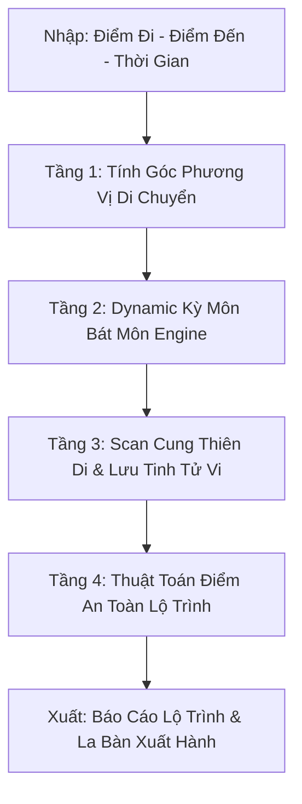

Kế hoạch chi tiết để phát triển tính năng **Bản Đồ Trạch Nhật Di Chuyển & An Toàn Lộ Trình (Astro-Geographic & Safe Route Engine)** cho ứng dụng **NỘI TÂM**.

Tính năng này được thiết kế để giải quyết nhu cầu thực tế rất lớn của người dùng hiện đại: **Chọn ngày giờ xuất hành, đặt vé máy bay, di chuyển công tác, du lịch xa, hoặc chuyển nhà** sao cho hanh thông, hạn chế tối đa nguy cơ va chạm, hoãn chuyến hay phát sinh rắc rối.

---

## 🎯 1. Mục Tiêu & Giá Trị Cốt Lõi

* **Tối Ưu Thời Không (Space-Time Optimization):** Không chỉ xem "ngày tốt" chung chung, mà kết hợp **Hướng di chuyển thực tế (Góc phương vị)** với **Khung giờ hoàng đạo/Kỳ Môn** và **Cung Thiên Di trên lá số Tử Vi cá nhân**.
* **Cảnh Báo An Toàn Real-Time (Safe Route Score):** Đưa ra chỉ số an toàn giao thông & lộ trình (từ 0–100 điểm) dựa trên sự tương tác giữa Sát Tinh chiếu Cung Thiên Di và Cửa Hung của Kỳ Môn Độn Giáp.
* **Chuyển Hóa Hành Động Cải Mệnh (Active Mitigation):** Đề xuất giải pháp chủ động (trang phục, vật phẩm, góc khởi hành) nếu bắt buộc phải đi vào khung giờ/hướng chưa tối ưu.

---

## 📐 2. Kiến Trúc Thuật Toán Lõi 4 Tầng (4-Layer Route Engine)



### 🔹 Tầng 1: Thuật Toán Tính Góc Phương Vị (Direction Vector Engine)

Sử dụng công thức lượng giác bán cầu (Haversine/Bearing formula) để xác định chính xác góc hướng di chuyển $\theta$ từ Tọa độ xuất phát $(Lat_1, Lon_1)$ đến Tọa độ đích $(Lat_2, Lon_2)$:

$$\theta = \text{atan2}\left(\sin(\Delta Lon) \cdot \cos(Lat_2), \cos(Lat_1) \cdot \sin(Lat_2) - \sin(Lat_1) \cdot \cos(Lat_2) \cdot \cos(\Delta Lon)\right)$$

Góc $\theta$ ($0^\circ \rightarrow 360^\circ$) được quy đổi chính xác về 8 Quái phương vị: *Bắc (Khảm), Đông Bắc (Cấn), Đông (Chấn), Đông Nam (Tốn), Nam (Ly), Tây Nam (Khôn), Tây (Đoài), Tây Bắc (Càn)*.

---

### 🔹 Tầng 2: Kỳ Môn Bát Môn & Cát Thần Theo Giờ (QMDJ Dynamic Grid)

Hệ thống tự động an **Bát Môn** (Khai, Hưu, Sinh, Thương, Đỗ, Cảnh, Tử, Kinh) và **Cát Thần** (Hỷ Thần, Tài Thần, Quý Nhân) theo Tiết khí, Dương Độn/Âm Độn và Can Chi của giờ xuất phát:

| Trạng Thái Môn | Tên Cửa (Bát Môn) | Tác Động Khi Di Chuyển Theo Hướng Này |
| --- | --- | --- |
| 🟢 **Tam Cát Môn** | **Khai Môn** (Kim) | Hanh thông công việc, gặp đối tác, thăng tiến, mở màn thuận lợi. |
| 🟢 **Tam Cát Môn** | **Hưu Môn** (Thủy) | Bình an, thư thái, thích hợp du lịch nghỉ dưỡng, chữa lành. |
| 🟢 **Tam Cát Môn** | **Sinh Môn** (Thổ) | Mua bán tài sản, giao dịch tiền xâu, khởi công, sinh khí dạt dào. |
| 🟡 **Bình Môn** | **Cảnh Môn / Đỗ Môn** | Thích hợp xử lý văn thư, ngoại giao hoặc đi trú ẩn, tránh thị phi. |
| 🔴 **Tam Hung Môn** | **Thương Môn** (Mộc) | Dễ va chạm giao thông, tổn thương thể chất, hư hỏng phương tiện. |
| 🔴 **Tam Hung Môn** | **Tử Môn** (Thổ) | Trì trệ, trễ chuyến bay, gặp chướng ngại vật, năng lượng u uất. |
| 🔴 **Tam Hung Môn** | **Kinh Môn** (Kim) | Hoảng sợ, tranh chấp thủ tục, phạt hành chính, mất hành lý. |

---

### 🔹 Tầng 3: Tương Tác Cung Thiên Di Tử Vi Cá Nhân (Ziwei Travel Overlay)

Đối chiếu trực tiếp với lá số Tử Vi của người dùng tại thời điểm di chuyển:

* 🟢 **Cát Tinh Trợ Lực:** * **Lưu Thiên Mã đắc địa** (Dần, Tỵ, Thân): Chuyến đi diễn ra nhanh chóng, có quý nhân phù trợ.
* **Lưu Hóa Lộc / Lộc Tồn / Thanh Long:** Xuất hành gặt hái tài lộc, giao dịch thành công.


* 🔴 **Cảnh Báo Sát Tinh Chiếu Cung Thiên Di:**
* **Lưu Kình Dương / Lưu Hỏa Tinh:** Cảnh báo nguy cơ va chạm cơ khí, va quệt xe cộ.
* **Lưu Đà La / Lưu Hóa Kị:** Cảnh báo hoãn/hủy chuyến, nhầm lẫn giấy tờ, kẹt xe nghiêm trọng.
* **Lưu Bạch Hổ / Kiếp Sát:** Cần cẩn trọng chấn thương tay chân hoặc mất trộm đồ đạc.


---

### 🔹 Tầng 4: Công Thức Điểm An Toàn Lộ Trình (Safe Route Score - SRS)

$$\text{SRS} = 100 - (\text{Trọng số Hung Môn Kỳ Môn} \times 35) - (\text{Sát Tinh Cung Thiên Di} \times 35) - (\text{Ngày Hắc Đạo/Xung Tuổi} \times 30) + (\text{Cát Tinh \& Cát Môn Trợ Lực})$$

* **90 – 100 điểm (Thượng Cát):** Lộ trình Đại An. Khuyến nghị khởi hành đúng khung giờ này.
* **70 – 89 điểm (Bình An):** Thuận lợi, ít trở ngại.
* **50 – 69 điểm (Cần Thận Trọng):** Dễ kẹt xe, hoãn chuyến nhỏ. Cần kiểm tra kỹ phương tiện & giấy tờ.
* **Dưới 50 điểm (Nguy Cơ Cao):** Khuyên chuyển khung giờ hoặc thay đổi hướng đi ban đầu (đi chệch hướng Cát trước rồi mới rẽ về hướng đích).

---

## 🎨 3. Thiết Kế Giao Diện UI/UX & Trải Nghiệm Tương Tác

```
 ┌──────────────────────────────────────────────────────────┐
 │ 📍 BẢN ĐỒ TRẠCH NHẬT DI CHUYỂN & AN TOÀN LỘ TRÌNH        │
 ├──────────────────────────────────────────────────────────┤
 │  [Điểm xuất phát: TP.HCM] ──✈──> [Đích đến: Hà Nội]     │
 │  Góc di chuyển: 15° (Hướng Bắc - Cung Khảm)              │
 ├──────────────────────────────────────────────────────────┤
 │  📅 Ngày: 25/08/2026 | 🚗 Phương tiện: Máy Bay           │
 │  Chỉ số An Toàn Lộ Trình (SRS): [ 88/100 - BÌNH AN ]     │
 ├──────────────────────────────────────────────────────────┤
 │  🧭 DYNAMIC LA BÀN KỲ MÔN LỘ TRÌNH                       │
 │      BẮC (Khảm)  : [Hưu Môn 🟢]  ── Hướng Đi Đích        │
 │      ĐÔNG BẮC    : [Sinh Môn 🟢]                         │
 │      TÂY BẮC     : [Tử Môn 🔴]   ── Tránh Đi             │
 ├──────────────────────────────────────────────────────────┤
 │  ⏰ KHUNG GIỜ VÀNG XUẤT HÀNH TRONG NGÀY:                  │
 │   • 07:00 - 09:00 (Giờ Thìn - Khai Môn):  Score 95/100 🌟 │
 │   • 11:00 - 13:00 (Giờ Ngọ - Thương Môn): Score 42/100 ⚠️ │
 └──────────────────────────────────────────────────────────┘

```

### Các tính năng tương tác chính:

1. **Chế độ GPS Auto-Detect & Bearing Calculation:** Tự động lấy vị trí hiện tại và điểm đến do người dùng nhập để tính ngay hướng đi.
2. **Interactive Compass Overlay:** Hiển thị Vòng Bát Quái Kỳ Môn xoay theo cảm biến con quay hồi chuyển (Gyroscope) của điện thoại khi người dùng đứng trước cửa nhà/sân bay.
3. **Mẹo Cải Mệnh Di Chuyển (Route Remedies):**
* *Nếu phải đi vào hướng Hung Môn:* Đề xuất người dùng khởi hành bước ra khỏi nhà theo hướng Cát Môn (ví dụ hướng Đông) đi khoảng 100m, sau đó mới rẽ về hướng đi chính.
* *Màu sắc trợ lực:* Gợi ý màu trang phục hoặc vali hành lý mang Ngũ Hành bổ trợ để xả bớt Sát Tinh.


---

## 🛠️ 4. Cấu Trúc Mã Nguồn & Tích Hợp Code

### A. Phân Chỉnh File

* **Component UI mới:** Tạo `components/route_engine.js` xử lý Form nhập lộ trình, La bàn vẽ Canvas 2D/SVG và Bảng khuyến nghị.
* **Logic toán:** Mở rộng `data/astrology_logic.js` bổ sung các hàm:
* `calculateBearing(lat1, lon1, lat2, lon2)`
* `getQMDJEightGates(date, hour)`
* `calculateRouteSafetyScore(userChart, travelDate, bearing)`


### B. Dynamic JSON Data Schema (`route_schema.json`)

```json
{
  "route_request": {
    "origin": { "name": "Ho Chi Minh City", "lat": 10.8231, "lon": 106.6297 },
    "destination": { "name": "Hanoi", "lat": 21.0285, "lon": 105.8542 },
    "travel_date": "2026-08-25T08:00:00+07:00",
    "transport_mode": "flight"
  },
  "route_analysis": {
    "bearing_degree": 14.8,
    "direction_sector": "North",
    "qmdj_gate": "Hieu Mon (Rest Gate)",
    "gate_nature": "Auspicious",
    "ziwei_transit_status": {
      "thien_di_palace": "Ngo",
      "active_stars": ["Luu Thien Ma (Dac)", "Thanh Long"],
      "conflict_satellites": ["Luu Da La (Ham)"]
    },
    "safety_score": 88,
    "status": "Safe",
    "remedies": {
      "lucky_color": "Blue / White",
      "best_departure_window": "07:15 - 08:30",
      "avoid_window": "11:00 - 12:30"
    }
  }
}

```

---

## 📋 5. Bảng So Sánh Trước & Sau Khi Có Tính Năng

| Tiêu Chí | Xem Ngày Xuất Hành Truyền Thống | Safe Route Engine (NỘI TÂM) |
| --- | --- | --- |
| **Căn cứ chọn** | Chỉ xem ngày Hoàng Đạo chung cho mọi người. | **Cá nhân hóa 100%** theo Tọa độ lộ trình + Lá số Tử Vi. |
| **Yếu tố Không Gian** | Bỏ qua hướng di chuyển thực tế. | **Tính chính xác góc phương vị di chuyển** (Bearing). |
| **Xử lý tình huống** | Thấy ngày xấu thì hủy chuyến/lo sợ. | **Đưa ra giải pháp chuyển hướng (Step-out Remedy)** & Khung giờ khắc phục. |
| **Trải nghiệm UX** | Đọc bảng tra chữ viết rườm rà. | **La bàn trực quan 3D + Thang điểm SRS (0–100)** trực diện. |

---

Bạn có muốn chúng ta tiến hành viết đoạn mã **JavaScript toán học tính Góc Phương Vị & Quy đổi Bát Môn (`calculateBearing & getQMDJGate`)** hay thiết kế **Layout UI Form & La Bàn Tương Tác** cho file `components/route_engine.js` trước?