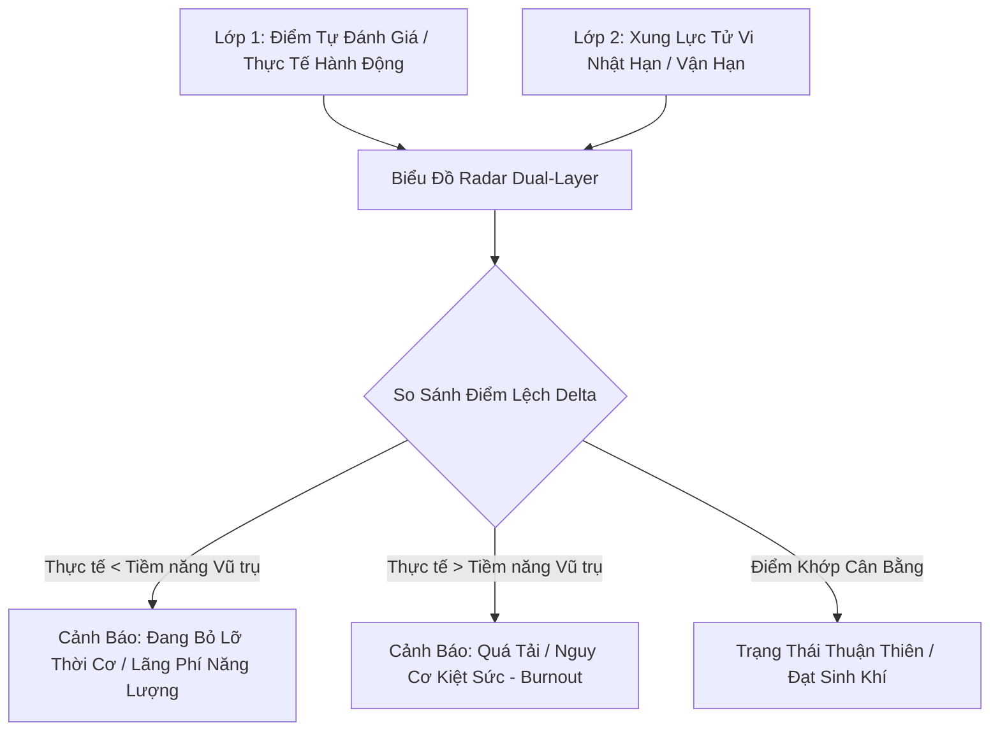

Ý tưởng **Bảng Cân Bằng "Năng Lượng Sống" 6 Trụ Cột (Life Energy Balance Radar)** là công cụ điều hành cấp cao giúp bạn nhìn lại toàn bộ bức tranh cuộc sống hàng tuần/hàng tháng một cách trực quan, khoa học và tĩnh lặng.

Thay vì quản lý công việc theo các KPI khô khan, tính năng này kết hợp giữa **Tự phản tư đa chiều (Self-Reflective Check-in)** và **Xung lực Vũ trụ (Astro Energy Transit Overlay)**. Nó giúp bạn nhanh chóng nhận ra mình đang quá dồn sức vào đâu, đang bỏ quên khía cạnh nào, và thời điểm này năng lượng tự nhiên đang hậu thuẫn cho trụ cột nào nhất.

---

## 🎯 1. Khai Thư Bát Quái & 6 Trụ Cột Đời Sống

Bản đồ Radar được thiết kế dạng Lục Giác Cân Bằng (Hexagon Engine), ánh xạ chính xác từ 12 Cung Tử Vi và 6 khía cạnh nền tảng của cuộc sống:

```
                  1. THÂN TÂM (Sức Khỏe & Định Tâm)
                               /\
                              /  \
      6. TRI THỨC (Học Tập)  /    \  2. SỰ NGHIỆP (Công Việc)
     (Nhật ký / Phản tư)    /      \ (Dự án / Task)
                            \      /
     5. TÀI CHÍNH (Tích Lũy) \    /  3. GIA ĐẠO (Gia Đình)
                              \  /
                               \/
                  4. MỐI QUAN HỆ (Hợp Tác)

```

| Trụ Cột Đời Sống | Cung Tử Vi Tương Ứng | Chỉ Số Năng Lượng Đầu Vào (Input) |
| --- | --- | --- |
| **1. Thân Tâm (Health & Mind)** | **Tật Ách & Mệnh/Thân** | Điểm sức khỏe thể chất + Tần suất hoàn thành Checklist Dưỡng Sinh/Thiền định. |
| **2. Sự Nghiệp (Career & Focus)** | **Quan Lộc** | Tiến độ dự án cá nhân (`components/tasks.js`) + Mức độ tập trung công việc. |
| **3. Gia Đạo (Family & Home)** | **Phụ Mẫu, Huynh Đệ, Tử Tức** | Chất lượng thời gian dành cho gia đình + Sự bình an trong không gian sống. |
| **4. Mối Quan Hệ (Relationships)** | **Nô Bộc & Phu Thê** | Mức độ hài lòng trong giao tiếp, tương tác với bạn bè, đối tác, người thân. |
| **5. Tài Chính (Finance & Assets)** | **Tài Bạch & Điền Trạch** | Mức độ kiểm soát ngân sách + Quản trị dòng tiền & tài sản tích lũy. |
| **6. Tri Thức (Knowledge & Soul)** | **Phúc Đức & Tri Thức** | Số lượng bài học đúc kết + Viết nhật ký phản tư (`components/knowledge.js`). |

---

## 📐 2. Thuật Toán Lõi "Dual-Layer Radar Engine"

Điểm đột phá của tính năng này là sự **chồng lớp (Overlay)** giữa 2 đường biểu đồ:



### 🔹 Lớp 1: Biểu Đồ Thực Tế (Subjective & Task Score - Đường Màu Xanh)

* **Tự Check-in (30%):** Cuối mỗi tuần (hoặc mỗi tháng), bạn dành 1–2 phút kéo 6 thanh trượt từ 1–10 điểm cho 6 trụ cột.
* **Auto Log-Data (70%):** Thuật toán tự động quét dữ liệu thực tế trong tuần từ các file component:
* Số nhiệm vụ cải mệnh đã hoàn thành (`tasks.js`).
* Số bài viết nhật ký/bài học đã lưu (`knowledge.js`).
* Chỉ số nhịp sinh học trung bình tuần (`heatmap.js`).


### 🔹 Lớp 2: Biểu Đồ Tiềm Năng Vũ Trụ (Astro Transit Overlay - Đường Màu Vàng Hoàng Kim)

* Thuật toán trong `astrology_logic.js` phân tích chòm sao Lưu của tuần/tháng đó chiếu vào các Cung nào:
* Ví dụ: Tuần này **Lưu Hóa Lộc + Lưu Thiên Mã** nhập Cung Tài Bạch $\rightarrow$ Tiềm năng trụ cột **Tài Chính** vọt lên **90/100**.
* Tuần này **Lưu Hóa Kị** nhập Cung Tật Ách $\rightarrow$ Tiềm năng trụ cột **Thân Tâm** giảm xuống **40/100** (Vũ trụ nhắc bạn cần nghỉ ngơi, phòng thủ).


---

## 💡 3. Các Trạng Thái Phân Tích & Khuyến Nghị Tự Động

Sau khi đối chiếu 2 lớp biểu đồ, hệ thống đưa ra các **Insight Chiến Lược Cá Nhân**:

### 🔴 Case 1: "Cảnh Báo Lãng Phí Thời Cơ" (Opportunity Loss)

* **Tình huống:** Tiềm năng **Sự Nghiệp** tuần này đạt $90/100$ (do có *Lưu Khôi Việt / Lưu Hóa Khoa*), nhưng điểm **Sự Nghiệp** thực tế bạn đánh giá/thực hiện chỉ đạt $35/100$.
* **Insight:** *“Tuần này sóng Trí Tuệ & Công Danh của bạn đang ở đỉnh, nhưng bạn lại dành quá nhiều thời gian giải trí. Hãy tận dụng 3 ngày tới để xử lý task quan trọng nhất!”*

### 🟡 Case 2: "Cảnh Báo Quá Tải & Lệch Sinh Khí" (Over-Exertion Risk)

* **Tình huống:** Tiềm năng **Thân Tâm** tuần này chỉ đạt $40/100$ (do gặp *Lưu Kình Dương* + Sóng Thể Chất ở đáy), nhưng điểm **Sự Nghiệp** thực tế bạn đang gồng lên $95/100$.
* **Insight:** *“Bạn đang tiêu tốn quá nhiều năng lượng thân tâm cho công việc trong một tuần vận khí cần nghỉ ngơi. Cẩn trọng kiệt sức hoặc sự cố sức khỏe nhẹ vào cuối tuần.”*

### 🟢 Case 3: "Trạng Thái Cân Bằng Âm Dương" (Harmony)

* **Tình huống:** Điểm thực tế khớp $\pm 10\%$ so với đường tiềm năng năng lượng của tuần.
* **Insight:** *“Bạn đang đi đúng nhịp sóng năng lượng cá nhân. Mọi sự vận hành hanh thông, thân tâm an lạc.”*

---

## 🎨 4. Thiết Kế Giao Diện UI Widget (Dashboard Component)

Tích hợp trực tiếp thành Widget chính ở đầu trang **Dashboard (`components/dashboard.js`)**:

```
┌────────────────────────────────────────────────────────────────────────┐
│ 🕸️ BẢNG CÂN BẰNG NĂNG LƯỢNG SỐNG (TUẦN 30/2026)                        │
├────────────────────────────────────────────────────────────────────────┤
│                     [ Biểu Đồ Radar Canvas 2D ]                        │
│             🔹 Đường Xanh: Điểm Hành Động Thực Tế                     │
│             🟡 Đường Vàng: Nhịp Sóng Vận Hạn Cá Nhân                   │
│                                                                        │
│  1. Thân Tâm   : [████████░░] 80%  │ 4. Mối Quan Hệ: [██████░░░░] 60%  │
│  2. Sự Nghiệp  : [██████████] 95%  │ 5. Tài Chính  : [████████░░] 85%  │
│  3. Gia Đạo    : [██████░░░░] 60%  │ 6. Tri Thức   : [█████████░] 90%  │
├────────────────────────────────────────────────────────────────────────┤
│ 💡 ĐÚC KẾT CHIẾN LƯỢC TUẦN NÀY:                                        │
│  • Trụ cột Tri Thức & Sự Nghiệp đang rất mạnh.                         │
│  • Trụ cột Gia Đạo & Mối Quan Hệ đang thiếu năng lượng tích cực.       │
│  -> Khuyến nghị: Dành tối thứ 6 không làm việc, ăn tối cùng gia đình. │
│  [ 📝 Bấm để Check-in / Cập Nhật Điểm Tuần ]                             │
└────────────────────────────────────────────────────────────────────────┘

```

---

## 🛠️ 5. Cấu Trúc Mã Nguồn Integration

### A. Phân Chỉnh File

* **File Component:** Cập nhật `components/dashboard.js` để render Radar Chart sử dụng Canvas API (không dùng thư viện ngoài để nhẹ app và bảo mật).
* **File Logic:** Thêm hàm `calculateLifeBalanceScores(userChart, dateRange)` trong `data/astrology_logic.js`.
* **Database/Storage:** Mã hóa và lưu trữ lịch sử check-in vào IndexedDB qua `app.js`.

### B. Dynamic JSON Schema (`life_balance_schema.json`)

```json
{
  "balance_record": {
    "week_number": 30,
    "year": 2026,
    "checkin_date": "2026-07-22",
    "real_scores": {
      "health_mind": 80,
      "career": 95,
      "family": 60,
      "relationship": 60,
      "finance": 85,
      "knowledge": 90
    },
    "astro_potential_scores": {
      "health_mind": 65,
      "career": 90,
      "family": 70,
      "relationship": 65,
      "finance": 90,
      "knowledge": 85
    },
    "insights": [
      "Sự Nghiệp và Tri Thức đạt đỉnh hiệu suất.",
      "Cần bổ sung thời gian cho Gia Đạo để tái tạo năng lượng Thổ/Thủy."
    ]
  }
}

```

---

Bạn có muốn chúng ta tiến hành viết đoạn mã **JavaScript vẽ Biểu đồ Radar bằng HTML5 Canvas** cho `components/dashboard.js` hay hàm **tính toán điểm tiềm năng Tử Vi `calculateLifeBalanceScores()**` trước?