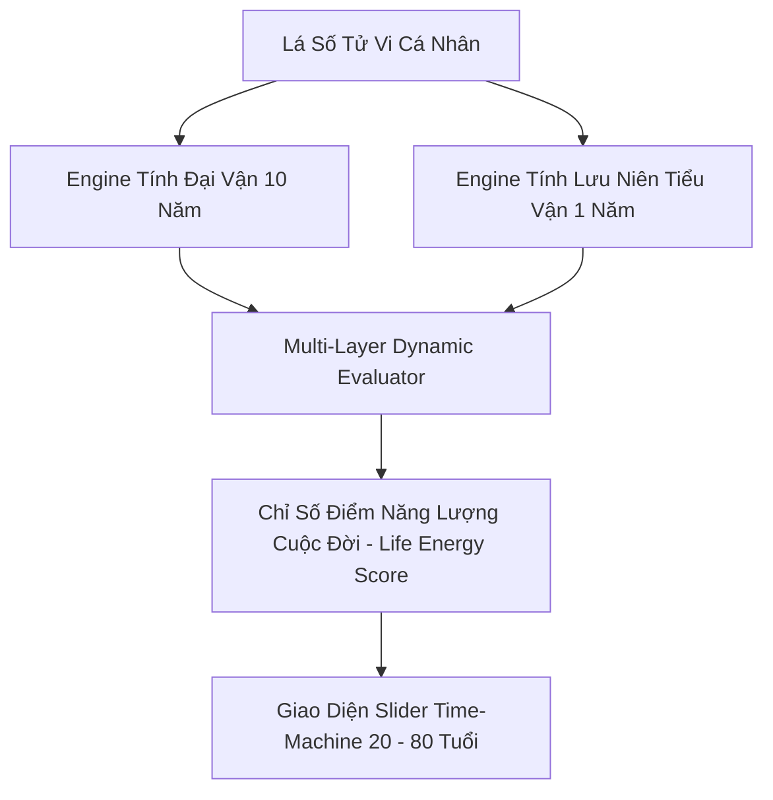

Ý tưởng **Trình Mô Phỏng "Time-Machine" Cuộc Đời Cá Nhân (Personal Life Time-Machine)** là mảnh ghép chiến lược giúp hoàn thiện bức tranh quản trị cuộc đời trên ứng dụng **NỘI TÂM**.

Khi ứng dụng được định hướng dùng **100% cho cá nhân bạn**, tính năng này không còn là công cụ "bói toán" xem tương lai thụ động, mà trở thành một **Bản đồ Chiến lược Thời gian (Long-Term Life Strategy Dashboard)**. Nó giúp bạn nhìn lại quá khứ để nghiệm lý, đánh giá hiện tại và chủ động điều phối nguồn lực (Tài chính, Sức khỏe, Sự nghiệp, Mối quan hệ) cho từng thập kỷ trong tương lai (từ 20 đến 80 tuổi).

---

## 🎯 1. Mục Tiêu & Triết Lý Vận Hành

* **Nhìn Toàn Cảnh (Macro View):** Giúp bạn thoát khỏi góc nhìn ngắn hạn từng ngày/tháng để thấy rõ "Nhịp sóng Đại vận 10 năm" và "Nhịp biến động Tiểu vận từng năm".
* **Chủ Động Điều Phối Nguồn Lực (Resource Allocation):**
* **Năm Vượng (Đại Cát):** Tấn công mạnh mẽ, mở rộng quy mô, đầu tư, bứt phá sự nghiệp.
* **Năm Thâm (Trì Trệ/Hung):** Phòng thủ, tích lũy tài sản an toàn, rèn luyện tri thức/tâm tính, chú trọng sức khỏe.


* **Chiêm Nghiệm Quá Khứ (Retro-Verification):** Kéo ngược thời gian về các mốc tuổi đã qua để kiểm chứng xem các biến cố đời thực (đô nghiệp, kết hôn, sự cố tài chính) có khớp với các mắt xích sao Lưu trên lá số không.

---

## 📐 2. Kiến Trúc Thuật Toán Lõi (Life Time-Machine Engine)

Engine này tổng hợp dữ liệu từ `tuvi.js` và `astrology_logic.js` để tạo ra biểu đồ năng lượng đa tầng theo trục thời gian:



### 🔹 Các Chỉ Số Đánh Giá Theo Mốc Năm ($Year_t$):

1. **Chỉ Số Đại Vận 10 Năm ($Decade\_Score$):** Đánh giá Cung Đại Vận hiện tại (Tam hợp Thái Tuế, Ngũ hành Nạp âm bản Mệnh tương sinh/tương khắc với Ngũ hành Cung Đại Vận, Tụ hội Cát/Hung tinh).
2. **Chỉ Số Lưu Niên 1 Năm ($Annual\_Score$):**

* Tương tác giữa Cung Tiểu Vận với các sao Lưu (*Lưu Thái Tuế, Lưu Lộc Tồn, Lưu Hóa Lộc, Lưu Hóa Kị, Lưu Kình Đà, Lưu Thiên Mã*).
* Điểm xung khắc/tương sinh của Can Chi năm đó với Can Chi tuổi của bạn.

3. **Tổng Điểm Năng Lượng Năm ($LES_t$):**

$$LES_t = (Decade\_Score \times 0.6) + (Annual\_Score \times 0.4)$$

---

## 🎨 3. Thiết Kế Giao Diện UI/UX & Trải Nghiệm Tương Tác

Component mới: **`components/timemachine.js`** (Được tích hợp thành 1 Sub-tab chính trong Hub Tử Vi `components/astrology.js`).

### A. Dynamic Timeline Slider (Thanh Trượt Thời Gian Tương Tác)

Giao diện hiển thị một thanh trượt từ tuổi **20 đến 80**:

```
 [ 20 ] ─── [ 30 ] ─── [ 40 ] ─── [ 50 ] ─── [ 60 ] ─── [ 70 ] ─── [ 80 Tuổi ]
                 ▲ (Bấm hoặc kéo thả đến mốc tuổi/năm muốn xem)

```

* **Dãy Đèn Tín Hiệu Năng Lượng (Energy Heatmap Strip):** Phía dưới thanh trượt có một dải màu phủ nền:
* 🟢 **Màu Xanh Tươi:** Năm Thắng Lực (Mọi sự hanh thông, điểm $LES \ge 80$).
* 🟡 **Màu Vàng:** Năm Bình Hòa ($50 \le LES < 80$).
* 🔴 **Màu Đỏ Cam:** Năm Cần Phòng Thủ ($LES < 50$).


---

### B. Bảng Phân Tích Mốc Thời Gian Được Chọn (Selected Year Dashboard)

Khi bạn kéo chọn mốc **Ví dụ: Tuổi 38 (Năm 2033)**, giao diện bên dưới lập tức cập nhật toàn bộ báo cáo:

```
┌──────────────────────────────────────────────────────────────────────────────┐
│ ⏳ TIME-MACHINE: TUỔI 38 (NĂM 2033 - QUÝ SỬU)                                │
├──────────────────────────────────────────────────────────────────────────────┤
│ 📊 ĐIỂM NĂNG LƯỢNG NĂM (LES): 85/100 [ 🟢 TẤN CÔNG & BỨT PHÁ ]                │
│ 🏰 Đại Vận: 33 - 42 Tuổi tại Cung Thân (Thái Tuế + Hóa Lộc)                 │
├──────────────────────────────────────────────────────────────────────────────┤
│ 🎯 ĐÁNH GIÁ 4 TRỤ CỘT ĐỜI SỐNG:                                             │
│  💼 Sự Nghiệp & Công Danh : [██████████░░] 85%  ── Lưu Lộc Tồn chiếu Quan.   │
│  💰 Tài Chính & Tài Sản   : [████████████] 95%  ── Cơ hội tích lũy BĐS lớn. │
│  🧘 Sức Khỏe & Thân Tâm   : [███████░░░░░] 60%  ── Lưu Kình Dương: Tránh kiệt sức.│
│  ❤️ Mối Quan Hệ & Gia Đạo : [████████░░░░] 75%  ── Hưu hòa, gia đạo êm ấm.  │
├──────────────────────────────────────────────────────────────────────────────┤
│ 📝 CHIẾN LƯỢC CÁ NHÂN HÓA NĂM 2033:                                          │
│  • Khuyên: Đã có nền tảng Đại Vận tốt, thích hợp mở rộng đầu tư tài sản dài hạn.│
│  • Cảnh báo: Tháng 5 & Tháng 9 âm lịch gặp Lưu Hóa Kị, chú ý ký kết giấy tờ. │
│  • Quẻ Dịch Chủ Năm: Quẻ Lôi Thiên Đại Tráng (Thế khí đang lên, giữ kỷ luật).│
└──────────────────────────────────────────────────────────────────────────────┘

```

---

### C. Tính Năng "Life Milestone Pinning" (Ghim Cột Mốc Cuộc Đời)

Vì là ứng dụng riêng tư của bạn, bạn có thể **ghim các mục tiêu đời thực** vào từng mốc năm trên thanh trượt để theo dõi:

* **Quá Khứ (Ghi vết kiểm chứng):**
* *Tuổi 22:* Tốt nghiệp Đại học.
* *Tuổi 26:* Mua căn nhà đầu tiên.


* **Tương Lai (Lập kế hoạch):**
* *Tuổi 35:* Kế hoạch khởi nghiệp công ty riêng.
* *Tuổi 45:* Xây dựng quỹ hưu trí & chuyển sang giảng dạy/cố vấn.
* *Tuổi 55:* Tập trung du lịch dưỡng sinh & nghiên cứu triết học/lý học.


👉 **Khi bạn bấm vào cột mốc tương lai**, hệ thống sẽ phân tích xem năm đó **Tọa độ Tử Vi / Lưu Tinh có ủng hộ mục tiêu đó hay không** và đưa ra lời khuyên chuẩn bị trước 1–2 năm.

---

## 🛠️ 4. Tích Hợp Vào Cấu Trúc Mã Nguồn Current App

### A. Phân Chỉnh File & Component

1. **Component UI:** Tạo `components/timemachine.js` quản lý Thanh trượt Timeline, Biểu đồ Radar 4 trụ cột và Bảng hiển thị chiến lược.
2. **Logic Engine:** Thêm hàm `calculateLifeTimeline(userChart)` trong `data/astrology_logic.js` để tính toán trước mảng dữ liệu 60 năm (từ 20–80 tuổi) ngay khi ứng dụng khởi chạy.


3. **Bảo mật:** Toàn bộ ghi chú cột mốc riêng tư được mã hóa lưu trữ ở IndexedDB cá nhân qua `app.js`.


### B. Cấu Trúc Dữ Liệu JSON (`timemachine_schema.json`)

```json
{
  "user_timeline": {
    "birth_year": 1995,
    "current_age": 31,
    "yearly_data": [
      {
        "age": 38,
        "calendar_year": 2033,
        "can_chi": "Quy Suu",
        "decade_range": "33-42",
        "decade_palace": "Shen",
        "les_score": 85,
        "status_flag": "Aggressive Growth",
        "four_pillars": {
          "career": 85,
          "finance": 95,
          "health": 60,
          "relationship": 75
        },
        "key_active_stars": ["Luu Loc Ton", "Luu Thien Ma", "Luu Kinh Duong"],
        "pinned_milestone": "Mua bất động sản thứ 2",
        "strategic_advice": "Năm có Lưu Lộc Tồn + Lưu Thiên Mã, tài chính đột biến từ việc di chuyển/mở rộng. Giữ sức khỏe vùng cổ vai gáy."
      }
    ]
  }
}

```

---

## 📋 5. Giá Trị Thực Chiến Khi Sử Dụng Cá Nhân

| Tiêu Chí | Xem Tử Vi Xem Vận Hạn Phổ Thông | Personal Life Time-Machine |
| --- | --- | --- |
| **Tầm nhìn** | Chỉ xem 1 năm hiện tại rồi quên. | **Nhìn thấy bức tranh tổng thể 60 năm cuộc đời**. |
| **Tính ứng dụng** | Phụ thuộc lời bói chung chung. | **Cá nhân hóa thành Bảng Quản Trị Mục Tiêu & Nguồn Lực**. |
| **Trải nghiệm UX** | Đọc tài liệu dài khô khan. | **Thanh trượt tương tác UI visual**, trượt đến đâu dữ liệu đổi đến đó. |
| **Tính bảo mật** | Dễ rò rỉ thông tin riêng tư. | **Mã hóa 100% trên thiết bị cá nhân** của chính bạn.

 |

---

Bạn có muốn chúng ta tiến hành viết mã nguồn JavaScript mẫu cho thuật toán tính toán mốc thời gian **`calculateLifeTimeline()`** trong `data/astrology_logic.js` hay thiết kế khung giao diện HTML/CSS cho **`components/timemachine.js`** trước?