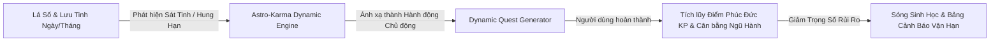
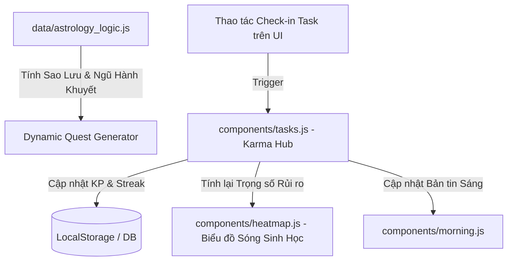

Ý tưởng **Hub Game Hóa Cải Mệnh & Bảng Cân Bằng Phúc Đức (Karma & Habit Hub)** là bước chuyển hóa có tính cách mạng trong ứng dụng **NỘI TÂM**.

Trong Tử Vi và Lý Học Đông Phương truyền thống, con người thường rơi vào tâm lý thụ động ("chờ vận tốt đến" hoặc "lo sợ hạn xấu"). Tính năng này đảo ngược triết lý dựa trên nguyên lý **"Dụng Vạn Hành để Chuyển Vạn Hạn"** — Số hóa cuốn sổ *"Công Quá Cách"* huyền thoại của Liễu Phàm (Liễu Phàm Tứ Huấn) thành một **Hệ thống Quản trị Thói quen & Tích lũy Năng lượng Dương (Game-ified Karma Ledger)** cá nhân hóa 100% theo lá số.

---

## 1. Cơ Cơ Thuật Toán Lõi: Tiêu Hóa Sát Tinh & Cân Bằng Ngũ Hành (Astro-Karma Engine)

Thuật toán không chỉ đếm số thói quen hoàn thành, mà **chuyển hóa trực tiếp năng lượng tiêu cực của các Sao Lưu / Sát Tinh trong ngày/tháng/năm thành các hành động ứng hợp chủ động**.



### A. Ma Trận Ánh Xạ Sát Tinh $\rightarrow$ Hành Động Hóa Giải (Action Mapping Matrix)

| Sao Hung / Sát Tinh Chiếu | Năng Lượng Tiêu Cực Phát Tác | Hành Động Chủ Động Chuyển Hóa (Action Remedy) | Ngũ Hành Bổ Trợ |
| --- | --- | --- | --- |
| **Lưu Kình Dương / Hỏa Tinh** | Nóng nảy, dễ va chạm xô sát, xung đột, tổn thương thể chất. | • Tập thể dục cường độ cao (HIIT/Gym) để xả bớt năng lượng Kim/Hỏa dư thừa.<br>

<br>• Chủ động đi hiến máu nhân đạo hoặc cạo vôi răng (Ứng trước "Huyết quang"). | **Kim / Hỏa** |
| **Lưu Đà La / Âm Sát** | Trì trệ, do dự, suy nghĩ tiêu cực vướng mắc, dằn dặt nội tâm. | • Thiền định quan sát hơi thở 15–20 phút.<br>

<br>• Sắp xếp & dọn dẹp không gian sống tối giản (Decluttering). | **Thổ / Kim** |
| **Lưu Hóa Kị / Cự Môn** | Thị phi, hiểu lầm, khẩu nghiệp, giao tiếp trục trặc. | • Thực hành "Ái Ngữ" (Chỉ nói lời nâng đỡ, không chỉ trích).<br>

<br>• Thực hành Nhẫn Nại & Lắng nghe thụ động trong các cuộc họp. | **Thủy** |
| **Lưu Địa Không / Địa Kiếp** | Bị lừa gạt, mất tiền đột ngột, tâm lý hoang phí, FOMO. | • 主 động "Tự Xả Tài": Quyên góp 2–5% thu nhập ngày/tuần vào quỹ từ thiện.<br>

<br>• Phóng sanh hoặc mua thức ăn cho động vật lang thang. | **Hỏa / Thủy** |
| **Lưu Thiên Hình / Quan Phủ** | Vướng mắc pháp lý, thủ tục, tranh chấp, vi phạm quy định. | • Rà soát lại toàn bộ hợp đồng, giấy tờ, hóa đơn chưa thanh toán.<br>

<br>• Tuân thủ tuyệt đối luật giao thông và quy định nơi làm việc. | **Kim** |

---

## 2. Hệ Thống Nhiệm Vụ 3 Tầng (Dynamic Quest Engine)

Tích hợp trực tiếp vào module `components/tasks.js` và `components/morning.js`:

### 🔹 Tầng 1: Daily Micro-Quests (Nhiệm Vụ Nhật Hạn)

* Tự động sinh ra mỗi sáng dựa trên chùm sao Lưu của ngày.
* **Ví dụ ngày có Lưu Hóa Khoa + Lưu Mộc Dục:** Quest *"Đọc 20 trang sách tri thức mới & Dành 30 phút chăm sóc bản thân/ngâm chân thảo dược"* ($+15$ Điểm Phúc Đức).

### 🔹 Tầng 2: Monthly Campaign (Chiến Dịch Hóa Giải Tháng)

* Dựa trên Cung Tiểu Hạn của tháng.
* **Ví dụ:** Tháng này Cung Tật Ách gặp *Lưu Hóa Kị*, hệ thống kích hoạt Chiến dịch 30 ngày *"Detox Thân Tâm"*: Uống đủ 2L nước, ăn chay 4 ngày âm lịch, nghe tần số 528Hz mỗi tối.

### 🔹 Tầng 3: Core Life Mastery Quests (Tích Tắc 100 Mục Tử Vi)

* Liên kết trực tiếp với **PHẦN V: Chiến lược Cải Mệnh** trong bộ 100 chỉ số Tử Vi cá nhân (Mục 91–100).
* Xây dựng thói quen dài hạn: Rèn luyện tâm tính theo chính tinh thủ Mệnh (Ví dụ: Mệnh *Thái Dương* rèn tính bao dung, Mệnh *Vũ Khúc* rèn tính quản lý tài chính kỷ luật).

---

## 3. Giao Diện Visual Game-ification & Bảng Cân Bằng Phúc Đức

### A. Chỉ Số Phúc Đức (Karma Points - KP) & Cấp Độ Tiến Hóa Tâm Tính

Người dùng không "lên level" bằng việc đánh quái, mà lên cấp bằng **mức độ kiên trì tu rèn và chuyển hóa bản thân**:

```
[Lv 1: Người Quan Sát] ──(100 KP)──> [Lv 2: Người Rèn Tâm] ──(500 KP)──> [Lv 3: Kiến Trúc Sư Cải Mệnh] ──(2000 KP)──> [Lv 4: Bậc Định Tâm]

```

* **Chuỗi Streak (Duy trì nếp sống):** Hoàn thành liên tục 7-21-90 ngày sẽ nhân hệ số điểm KP (Dopamine Loop tích cực).

### B. Biểu Đồ Radar Cân Bằng Ngũ Hành Real-time (Elements Harmony Radar)

Hiển thị sự chuyển biến năng lượng ngũ hành của cơ thể dựa trên các nhiệm vụ đã làm trong tuần:

```
          MỘC (Tri thức / Tăng trưởng)
                  /\
                 /  \
  THỦY (Tâm trí)/    \ HỎA (Hành động / Thể thao)
  (Thiền/Lắng nghe)\  /
            \  /
             \/
THỔ (Định tâm / Từ thiện) ── KIM (Kỷ luật / Sắp xếp)

```

* Nếu biểu đồ lệch hẳn về *Hỏa* (hoạt động quá nhiều, căng thẳng) nhưng khuyết *Thủy/Thổ*, hệ thống sẽ gợi ý các bài tập Thiền, Yoga hoặc nghe nhạc sóng não để kéo năng lượng về trạng thái cân bằng.

### C. Phần Thưởng Mở Khóa (Soul Rewards)

* **Sound Healing & Solfeggio Frequencies:** Mở khóa các bản nhạc tần số năng lượng (432Hz - Thiền định, 528Hz - Sửa chữa DNA/Tế bào, 639Hz - Chữa lành mối quan hệ) tương ứng với sao Cát ghé thăm.
* **Bio-Nutrition Drops:** Đơn thuốc thực dưỡng Đông Y cá nhân hóa từ `components/health.js`.

---

## 4. Kiến Trúc Tích Hợp Lập Trình (Software Architecture)

### A. Sơ Đồ Luồng Tích Hợp Mã Nguồn



### B. Cấu Trúc Dữ Liệu JSON (Karma & Quest Schema)

```json
{
  "user_karma_profile": {
    "total_kp": 1450,
    "current_level": "Kiến Trúc Sư Cải Mệnh (Lv 3)",
    "current_streak": 14,
    "element_balance_score": {
      "Wood": 80,
      "Fire": 65,
      "Earth": 90,
      "Metal": 75,
      "Water": 85
    }
  },
  "active_remedy_quests": [
    {
      "id": "q_20260722_01",
      "target_star": "Lưu Hóa Kị",
      "nature": "Sát Tinh",
      "title": "Chuyển hóa Khẩu Nghiệp - Thực hành Ái Ngữ",
      "description": "Hôm nay Lưu Hóa Kị chiếu Cung Nô Bộc. Tránh tranh luận vô bổ, khen ngợi ít nhất 2 đồng nghiệp.",
      "kp_reward": 20,
      "element_boost": "Water",
      "is_completed": false
    },
    {
      "id": "q_20260722_02",
      "target_star": "Lưu Kình Dương",
      "nature": "Sát Tinh",
      "title": "Xả Năng Lượng Kim/Hỏa - Vận Động Mạnh",
      "description": "Hoàn thành 30 phút chạy bộ hoặc bài tập Cardio để giải phóng áp lực tích tụ.",
      "kp_reward": 25,
      "element_boost": "Fire",
      "is_completed": true
    }
  ]
}

```

---

## 📋 Bảng So Sánh Hiệu Quả Trước & Sau Khi Game Hóa Cải Mệnh

| Tiêu Chí | Quản Lý Thói Quen Phổ Thông (Notion/Loop) | Karma & Habit Hub (NỘI TÂM) |
| --- | --- | --- |
| **Căn cứ tạo thói quen** | Tự nghĩ ra ngẫu nhiên, dễ bỏ cuộc. | **Cá nhân hóa theo Tử Vi & Nhật Hạn Real-time**. |
| **Động lực thực hiện** | Chỉ dừng ở tính kỷ luật đơn thuần. | **Cơ chế Hóa Giải Sát Tinh & Tích Điểm Phúc Đức**. |
| **Đo lường kết quả** | Đếm số lượng % hoàn thành. | **Đo lường sự Cân Bằng Ngũ Hành & Giảm rủi ro vận hạn**. |
| **Giá trị tinh thần** | Khô khan. | Biến việc tu rèn bản thân thành **hành trình thăng cấp linh hồn**. |

---

Bạn có muốn chúng ta tiến hành viết đoạn mã **JavaScript Logic sinh Quest tự động theo Sao Lưu (`generateKarmaQuests()`)** hay thiết kế **Layout UI Game-ification** cho `components/tasks.js` trước?