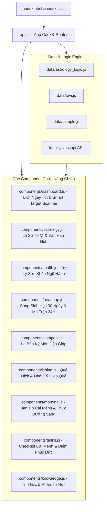

# Sơ Đồ Kiến Trúc & Các File Chức Năng Chính (Architecture & File Mapping)

Tài liệu này tổng hợp toàn bộ sơ đồ cấu trúc hệ thống, luồng dữ liệu và vai trò của từng file chức năng chính trong ứng dụng **NỘI TÂM — Tri Thức Cá Nhân & Tử Vi Ứng Dụng**.

---

## 1. Sơ Đồ Kiến Trúc Hệ Thống (System Architecture Diagram)

---

## 2. Chi Tiết Vai Trò Các File Chức Năng Chính

### ⚙️ Lớp Lõi & Dữ Liệu (Core & Data Engine)

| Đường Dẫn File | Vai Trò & Chức Năng Chính |
|---|---|
| [app.js](file:///i:/Drive%20c%E1%BB%A7a%20t%C3%B4i/apps/App_Canhan/app.js) | **Lõi ứng dụng**: Điều hướng SPA Router, quản lý trạng thái (`State`), quản lý bộ nhớ (`Storage`), hệ thống Modal, Toast notification, DetailPanel và Theme Manager. |
| [data/astrology_logic.js](file:///i:/Drive%20c%E1%BB%A7a%20t%C3%B4i/apps/App_Canhan/data/astrology_logic.js) | **Engine thuật toán trung tâm**:  • Tính Lá số Tử Vi & Vận hạn. • Thuật toán Trạch nhật 4 tầng chấm điểm Cát Hung. • Thuật toán **Sóng Nhịp Sinh Học 30 Ngày** (Physical, Emotional, Intellectual). • Thuật toán **Smart Target Scanner** (Săn Top 3 Ngày Vàng cho Thi Cử, Phỏng Vấn, Trình Sếp). |
| [data/tuvi.js](file:///i:/Drive%20c%E1%BB%A7a%20t%C3%B4i/apps/App_Canhan/data/tuvi.js) | Database 14 Chính Tinh, nhóm Sát Tinh và các luận giải chi tiết theo lá số cá nhân. |
| [data/sample.js](file:///i:/Drive%20c%E1%BB%A7a%20t%C3%B4i/apps/App_Canhan/data/sample.js) | Dữ liệu mẫu ban đầu cho Bài học, Quy luật, Lời nhắc và Nhật ký. |

---

### 🎨 Lớp Giao Diện & Điều Hướng (Layout & Design System)

| Đường Dẫn File | Vai Trò & Chức Năng Chính |
|---|---|
| [index.html](file:///i:/Drive%20c%E1%BB%A7a%20t%C3%B4i/apps/App_Canhan/index.html) | File HTML chính của ứng dụng Single Page Application (SPA). Khai báo các thẻ meta, Google Fonts, stylesheet và thứ tự nạp các file script JS. |
| [index.css](file:///i:/Drive%20c%E1%BB%A7a%20t%C3%B4i/apps/App_Canhan/index.css) | **Hệ thống Design System Đông Phương**: CSS Variables, HSL Color Palettes, Font Cinzel Hoàng Kim, Thẻ Card Tử Vi (`.tuvi-card`), Phân chia Section rõ ràng (`.ornamental-divider`), Responsive Layout và Đổi theme Ngũ Hành tự động. |
| [components/sidebar.js](file:///i:/Drive%20c%E1%BB%A7a%20t%C3%B4i/apps/App_Canhan/components/sidebar.js) | Thanh điều hướng Sidebar chính (Dashboard, Tử Vi, Kỳ Môn & Kinh Dịch, Tri Thức, Tìm Kiếm). |

---

### 🧩 Các Component Chức Năng Nghiệp Vụ (Functional Components)

| Đường Dẫn File | Vai Trò & Chức Năng Chính | Ghi Chú Tích Hợp |
|---|---|---|
| [components/dashboard.js](file:///i:/Drive%20c%E1%BB%A7a%20t%C3%B4i/apps/App_Canhan/components/dashboard.js) | **Lịch Ngày Tốt & Dashboard Hub**:  • Ma trận Lịch Ngày Tốt cá nhân hóa. • Tích hợp **Nhịp Giờ Hoàng Đạo 12 Canh Giờ** (xem trực tiếp trong Lịch & Modal ngày). • **Bảng Cân Bằng Năng Lượng Sống 6 Trụ Cột** (Dual-Layer Radar Chart bằng HTML5 Canvas API). • Công cụ **Smart Target Scanner** săn Top 3 ngày vàng. • Bảng **Master Năng Lượng Ngày 13-in-1** tổng hợp. • Modal Chi Tiết Ngày Đa Tầng (7 Tab). | Tích hợp Tử Vi, Biorhythm, Nhịp Giờ 24H, 6 Trụ Cột Life Balance, Kỳ Môn, Kinh Dịch, Sức Khỏe, Thực Dưỡng và Tasks. |
| [components/heatmap.js](file:///i:/Drive%20c%E1%BB%A7a%20t%C3%B4i/apps/App_Canhan/components/heatmap.js) | **Nhịp Năng Lượng 30 Ngày & 24 Giờ**:  • Sub-tab 1: Biểu đồ **Sóng Nhịp Sinh Học 30 Ngày** (Sóng Thể Chất, Cảm Xúc, Trí Tuệ). • Sub-tab 2: **Ma Trận Giờ Hoàng Đạo 24H** & Smart Hour Finder. | Kết hợp Biorhythm toán học & Tử Vi. |
| [components/compass.js](file:///i:/Drive%20c%E1%BB%A7a%20t%C3%B4i/apps/App_Canhan/components/compass.js) | **La Bàn Kỳ Môn Độn Giáp**:  • Bát Môn xoay real-time (Khai Môn, Sinh Môn,...). • Định vị Tài Thần, Hỷ Thần, Quý Nhân theo Can ngày. • Kỹ thuật "Xuất Hành Nạp Khí". | Nằm trong tab **Kỳ Môn** của Oracle Hub. |
| [components/iching.js](file:///i:/Drive%20c%E1%BB%A7a%20t%C3%B4i/apps/App_Canhan/components/iching.js) | **Quẻ Dịch & Nhật Ký Gieo Quẻ**:  • 64 Quẻ Kinh Dịch. • Lập Quẻ Chủ Ngày theo **Mai Hoa Dịch Số**. • Gieo quẻ 3D đồng xu & Nhật ký chiêm nghiệm. | Nằm trong tab **Kinh Dịch** của Oracle Hub. |
| [components/health.js](file:///i:/Drive%20c%E1%BB%A7a%20t%C3%B4i/apps/App_Canhan/components/health.js) | **Trợ Lý Sức Khỏe Ngũ Hành**:  • Bản đồ cơ thể 3D/2D cảnh báo tạng phủ dễ tổn thương theo chùm sao Nhật hạn. • Khung giờ khám/chữa bệnh tốt nhất & Thực dưỡng Đông Y. | Nằm trong tab **Sức Khỏe** của Tử Vi Hub. |
| [components/morning.js](file:///i:/Drive%20c%E1%BB%A7a%20t%C3%B4i/apps/App_Canhan/components/morning.js) | **Bản Tin Cải Mệnh & Thực Dưỡng Buổi Sáng**:  • Đơn thuốc 4 Trụ cột Ngũ Hành (Y Phục, Thực Dưỡng Trà, Solfeggio 528Hz, Vi Hành Động). | Tích hợp vào Dashboard & Tử Vi Hub. |
| [components/tasks.js](file:///i:/Drive%20c%E1%BB%A7a%20t%C3%B4i/apps/App_Canhan/components/tasks.js) | **Checklist Nhiệm Vụ Cải Mệnh**:  • Bốc 4-5 task rèn luyện tâm tính & hành thiện giải hạn. • Tích lũy **Điểm Phúc Đức** (Cung Phúc Đức Ảo). • Báo cáo tổng kết tuần. | Tích hợp vào Dashboard & Tử Vi Hub. |
| [components/astrology.js](file:///i:/Drive%20c%E1%BB%A7a%20t%C3%B4i/apps/App_Canhan/components/astrology.js) | **Tử Vi & Vận Hạn Hub**:  • Sub-tabs: Lá số Tử Vi, Nhiệm vụ Cải mệnh, Thực dưỡng sáng, Trợ lý sức khỏe, Nhịp giờ hoàng đạo, Tổng quan cuộc đời. | Hub điều hành chính về Tử Vi. |
| [components/oracle.js](file:///i:/Drive%20c%E1%BB%A7a%20t%C3%B4i/apps/App_Canhan/components/oracle.js) | **Kỳ Môn & Kinh Dịch Hub**: Quản lý 2 sub-tabs La Bàn Kỳ Môn & Quẻ Dịch. | Hub điều hành thuật số thời không. |
| [components/knowledge.js](file:///i:/Drive%20c%E1%BB%A7a%20t%C3%B4i/apps/App_Canhan/components/knowledge.js) | **Tri Thức & Phản Tư Hub**: Quản lý 4 sub-tabs Nhật ký, Bài học đúc kết, Quy luật cuộc sống và Lời nhắc. | Hub quản trị tri thức sống. |

---

## 3. Bảng Đối Chiếu 1-1 Giữa Các File Yêu Cầu (Note) & File Code Lập Trình

| File Note Yêu Cầu (`Note/`) | File Code Thực Thi (`components/` / `data/`) | Trang Thái |
|---|---|---|
| `[Done] Kế hoạch xây dựng web.md` | `app.js`, `index.html`, `index.css` | ✅ Completed |
| `[Done] Thuật Toán Trạch Nhật Cá Nhân Hóa.md` | `data/astrology_logic.js`, `components/dashboard.js` | ✅ Completed |
| `[Done] Lá số cá nhân.md` & `[Done] Tính toán tử vi.md` | `data/tuvi.js`, `components/astrology.js` | ✅ Completed |
| `[Done] Trợ Lý AI Cải Mệnh & Thực Dưỡng...` | `components/morning.js` | ✅ Completed |
| `[Done] Hệ thống Nhiệm vụ Cải mệnh .md` | `components/tasks.js` | ✅ Completed |
| `[Done] Quẻ Dịch Nhật Lịch & Nhật Ký Gieo Quẻ.md` | `components/iching.js` | ✅ Completed |
| `[Done] Báo Hướng Xuất Hành & La Bàn Kỳ Môn...` | `components/compass.js` | ✅ Completed |
| `[Done] Trợ lý sức khỏe & thể trạng cục bộ .md` | `components/health.js` | ✅ Completed |
| `[Done] Ma Trận Giờ Hoàng Đạo & Nhịp Năng Lượng.md` | `components/heatmap.js` | ✅ Completed |
| `[Done] Lịch Ngày Thăng Tiến & Thi Cử.md` | `data/astrology_logic.js`, `components/dashboard.js` | ✅ Completed |
| `[Done] Ma Trận Vượng Hãm Ngũ Hành & Nhịp Sinh Học...` | `data/astrology_logic.js`, `components/heatmap.js` | ✅ Completed |
| `Astro-Matrix 100 & Knowledge Graph.md` | `data/tuvi.js`, `components/overview.js`, `components/astrology.js`, `components/journal.js` | ✅ Completed |
| `Hub Game Hóa Cải Mệnh & Bảng Cân Bằng Phúc Đức.md` | `data/astrology_logic.js`, `components/tasks.js`, `components/heatmap.js`, `components/morning.js` | ✅ Completed |
| `Bản Đồ Phong Thủy Không Gian Tương Tác.md` | `data/astrology_logic.js`, `components/compass.js`, `components/dashboard.js` | ✅ Completed |
| `Bản Đồ Trạch Nhật Di Chuyển & An Toàn Lộ Trình.md` | `data/astrology_logic.js`, `components/compass.js`, `components/dashboard.js` | 🔄 In Progress / Spec Ready |
